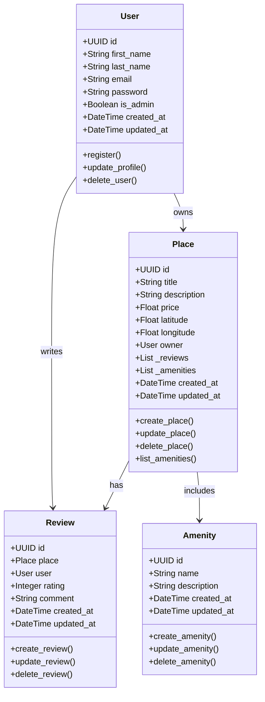
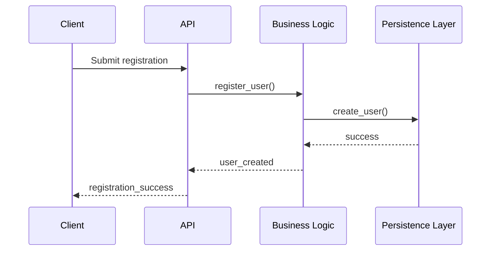
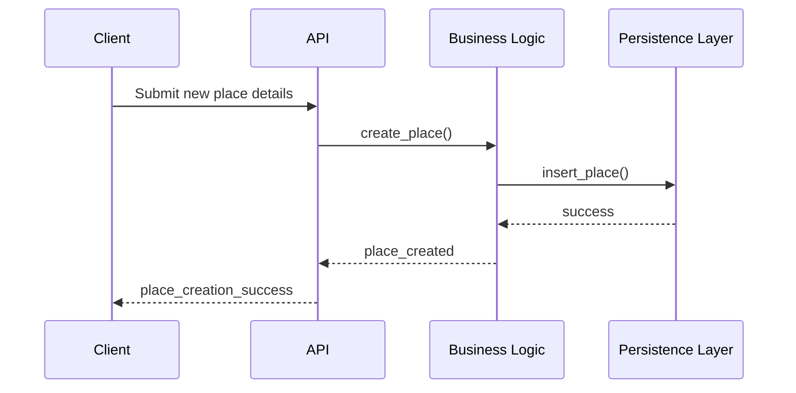
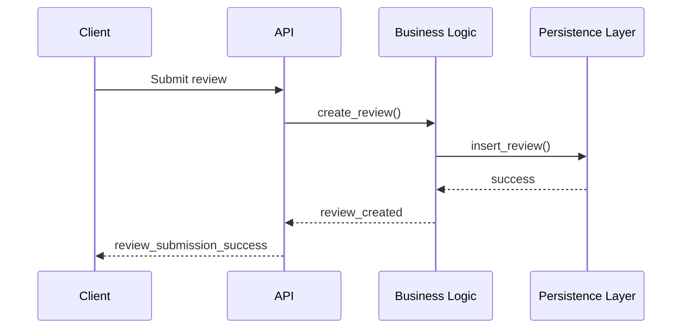
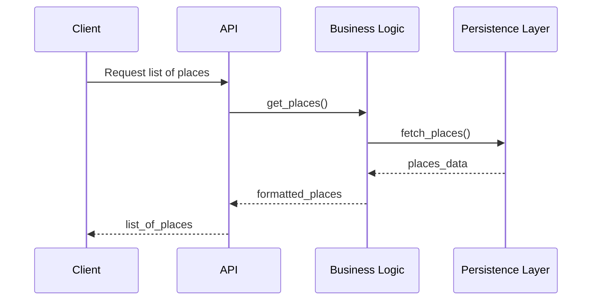

# **HBnB Evolution - Technical Documentation**

## **1. Introduction**

### **1.1 Purpose**

This document serves as a comprehensive technical blueprint for the **HBnB Evolution** application. It outlines system architecture, key entities, business logic, and API interactions. The goal is to provide developers and stakeholders with a clear understanding of the system design for implementation and maintenance.

### **1.2 Project Overview**

HBnB Evolution is a simplified **Airbnb-like platform** where users can:

* Register and manage their profiles.
* List properties (places) with details like price, description, and location.
* Leave reviews and ratings for places.
* Manage amenities associated with properties.

The system uses a **three-layer architecture** with a **Facade Pattern**, ensuring modularity, maintainability, and separation of concerns.

---

## **2. High-Level Architecture**

### **2.1 Three-Layer Architecture**

The application is organized into three main layers:

1. **Presentation Layer (API & Services)**

   * Handles user interactions and API requests.
   * Communicates with the Business Logic Layer through the Facade.

2. **Business Logic Layer (Models & Core Logic)**

   * Implements core functionalities.
   * Defines entities like **User, Place, Review, Amenity**.
   * Abstracts database operations through the Persistence Layer.

3. **Persistence Layer (Database Access)**

   * Manages storage and retrieval of data.
   * Provides CRUD operations for database entities.
   * Hidden behind the Business Logic Layer to prevent direct database dependency.

### **2.2 High-Level Package Diagram**

```mermaid
graph TD
    Presentation[Presentation Layer] -->|Uses| Facade[Business Logic Layer (Facade)]
    Facade -->|Uses| Persistence[Persistence Layer (Database)]
    Facade --> User[User Model]
    Facade --> Place[Place Model]
    Facade --> Review[Review Model]
    Facade --> Amenity[Amenity Model]
```

**Explanation:**
The **Facade Pattern** simplifies interaction between layers, hiding internal complexities and enforcing modularity.

---

## **3. Business Logic Layer**

### **3.1 Entities**

#### **3.1.1 User**

* **Attributes:** `id, first_name, last_name, email, password, is_admin, created_at, updated_at`
* **Methods:** `register(), update_profile(), delete_user()`
* **Description:** Represents system users who can own places and write reviews.

#### **3.1.2 Place**

* **Attributes:** `id, title, description, price, latitude, longitude, owner (User), _reviews, _amenities, created_at, updated_at`
* **Methods:** `create_place(), update_place(), delete_place(), list_amenities()`
* **Description:** Represents a property listed by a user, with amenities and reviews.

#### **3.1.3 Review**

* **Attributes:** `id, place (Place), user (User), rating, comment, created_at, updated_at`
* **Methods:** `create_review(), update_review(), delete_review()`
* **Description:** Represents a user’s review for a specific place.

#### **3.1.4 Amenity**

* **Attributes:** `id, name, description, created_at, updated_at`
* **Methods:** `create_amenity(), update_amenity(), delete_amenity()`
* **Description:** Represents additional features or services associated with places.

### **3.2 Class Diagram**



---

## **4. API Interaction Flow**

### **4.1 User Registration**



### **4.2 Place Creation**



### **4.3 Review Submission**



### **4.4 Fetching Places**



---

## **5. Conclusion**

This documentation consolidates the design and architecture of **HBnB Evolution**, including:

* **Three-layer architecture** with a Facade pattern.
* **Business Logic Layer** class diagram with entities and relationships.
* **API sequence diagrams** for core operations.

It ensures modularity, maintainability, and provides a clear reference for implementation.

---